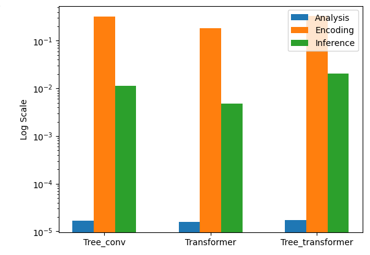
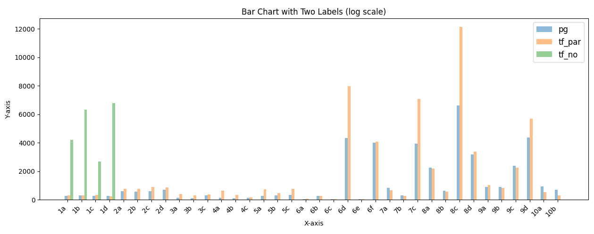
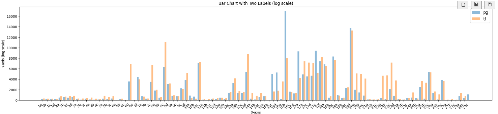
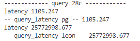

# LEON System Documentation

This document provides an overview of the LEON system, focusing on its training and inference components as implemented in `LEON_train.py` and `Leon_server.py`.

## Pre-requests
### GUC
Set following guc for enabling (enable_leon is off as default, not_cali is off as default)
```bash
enable_leon = on;
not_cali = off;
```
### Postgres Config
Load ./conf/LEON-postgresql.conf into postgresql

## LEON_train.py - Training Process
### TODO:
- [ ] write nodes file with ray
- [ ] pick_node
- [ ] train model


The training process is broken down into several steps, involving chunking queries, executing them, and using the feedback for training a model.


Queries are processed in batches for efficiency:

```python
chunks = chunk(Querylist, 5)

for chunk in chunks:
    for query in chunk:
        Feedback_1, Nodes = pg.execute(query, leon=on)  # Inference phase

    # Execution phase
    nodes_to_execute = Pick_node(Nodes)
    Feedback_2 = pg.execute(nodes_to_execute.to_sql(),
                            nodes_to_execute.to_hint(), 
                            leon=off) 
    experience = Exp(Feedback_1, Feedback_2)

    # Training phase
    experience.getpair()
    model.train()
```

## Leon_server.py - Inference Process
### TODO:
- [x] Fix json load errors (parsed from postgres)
- [x] Ingretation of transformer
- [x] Test inference efficiency and bottleneck

- [x] Test trained model ([SeqTransformer](https://github.com/liang-zibo/DACE))

    **pre-trained model for 10 templates**
    
    **pre-trained model for 30 templates (omit 28c)**
    
    **Warning: Query Regression on 28C**
    
    **End to End Runtime**
    |        | Runtime       |          |
    | :------: | :------: | ------: |
    ｜          | Postgres | SeqFormer |
    | with 28c      | 190.9s   | 26006.6s  |
    | without 28c   | 190.9s   | 233.7s    |

- [x] Multiple Database Execution for acceleration.
- [ ] Add Eqset Judgement for model inference
